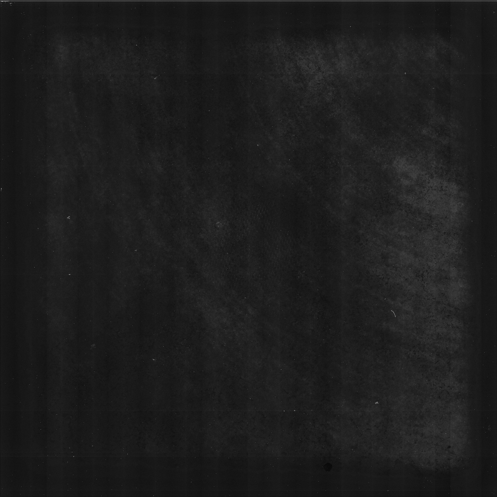
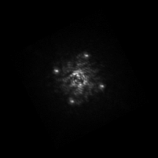
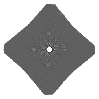
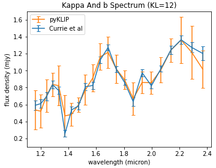

# CHARIS-PyKLIP Pipeline

    

## Description 
Developed during summer of 2020 as part of the ISG research program at Northwestern University. A data reduction pipeline that converts raw images from CHARIS into useful/presentable information regarding an exoplanet's spectrum. The pipeline has a total of 3 stages configurable in the config.ini file. Stage 1 uses the CHARIS Data Reduction Pipeline from http://princetonuniversity.github.io/charis-dep/ to reduce the raw CHARIS images. Stage 2 uses PyKLIP to denoise and extract the planet spectrum. Step 3 uses the various analysis tools defined in the modules directory to analyze the extracted spectrum from stage 2. Additional information regarding the research can be found in the documentation PDF and presentation slides on GitHub. 

## Use
Follow the descriptions in config.ini to properly configure the path to the raw images. When choosing to run stage 3 of the pipeline, edit main.py to suit the analysis needed. Finally, run main.py to start the pipeline.